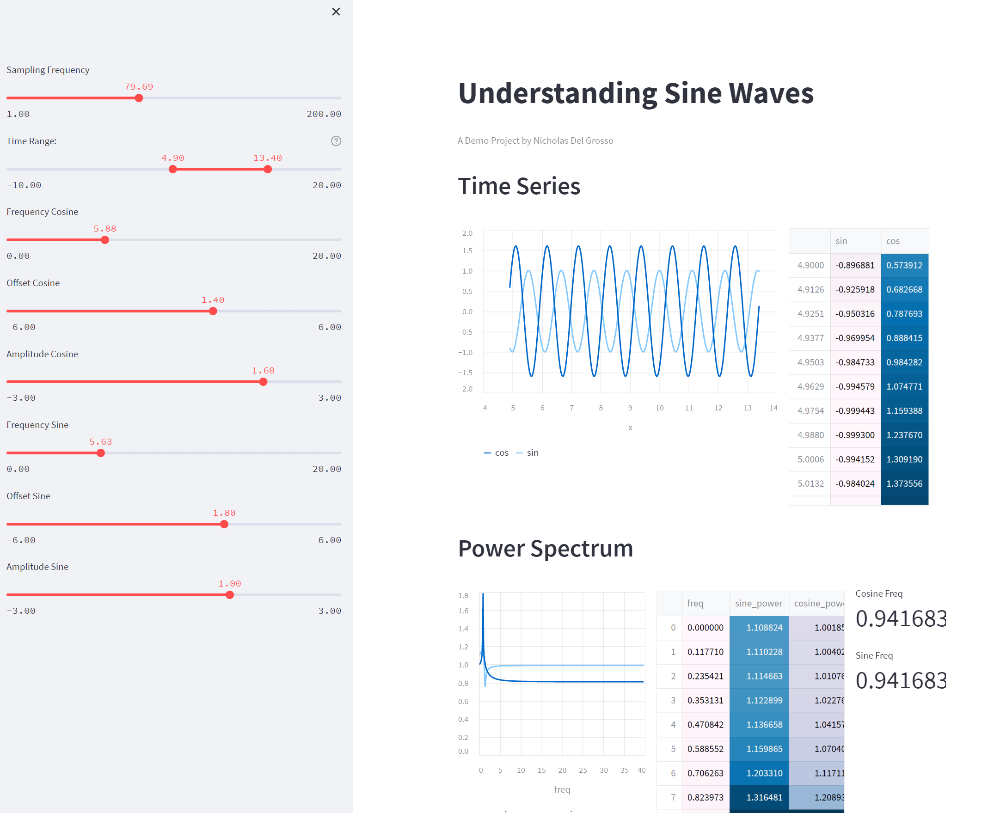

# How do you combine Streamlit, Python, and Matlab?

This was a small experiment used to learn Streamlit and Matlab's Python Engine. 
It shows a couple sine waves and computes a power spectrum (incorrectly, it turns out, though that's my fault)



## Install

### Install Matlab Engine

Note: need administrative permission in Windows
```
cd <matlab_install_directory>/extern/engines/python 
python setup.py install
```

### Install Python deps
```
pip install .
```

## Run
```
streamlit run main.py
```
